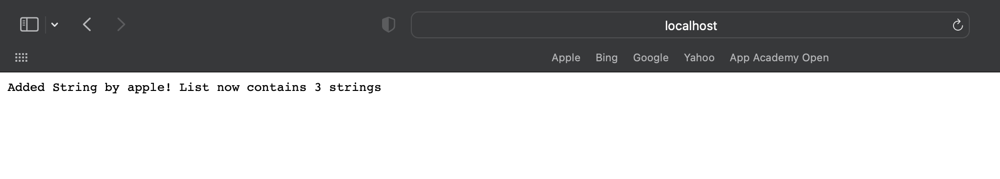
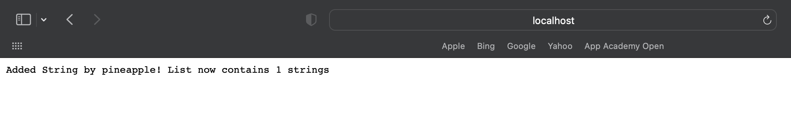
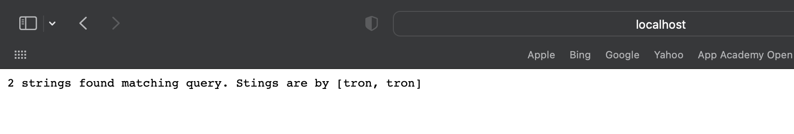
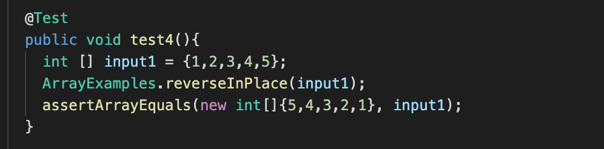
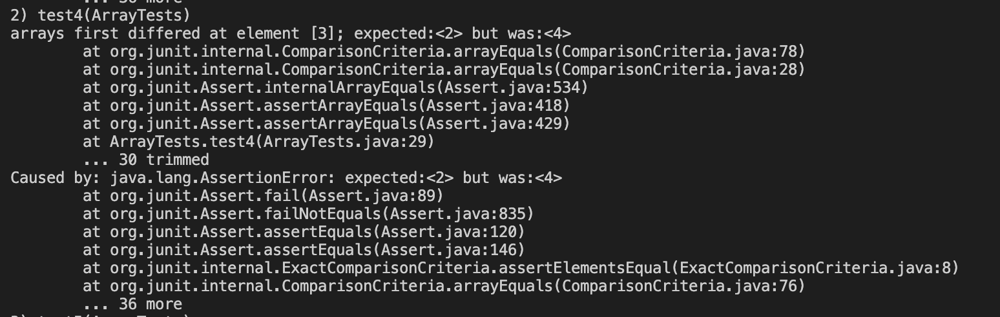

# Lab Report 2

## Part 1: Simplest Search Engine 
```
import java.io.IOException;
import java.net.URI;
import java.util.ArrayList;

class Handler implements URLHandler {
    // The one bit of state on the server: a number that will be manipulated by
    // various requests.

    ArrayList<String> listString = new ArrayList<>();

    public String handleRequest(URI url) {
        if (url.getPath().equals("/")) {
            return String.format("Number: %d", listString.toString());
        } else {
            System.out.println("Path: " + url.getPath());
            if (url.getPath().contains("/add")) {
                String[] parameters = url.getQuery().split("=");
                if (parameters[0].equals("s")) {
                    listString.add(parameters[1]);
                    return String.format("Added String by %s! List now contains %d strings", parameters[1], listString.size());
                }
            }
            else if(url.getPath().contains("/search")){
                String[] parameters = url.getQuery().split("=");
                if (parameters[0].equals("s")){
                    ArrayList<String> toReturn = new ArrayList<>();
                    for(String s: listString){
                        if (s.contains(parameters[1])) {
                            toReturn.add(parameters[1]);
                        }
                    }
                    return String.format("%d strings found matching query. Stings are by %s", toReturn.size(), toReturn.toString());
                }

            }

             

            return "404 Not Found!";
        }
    }

}

class SearchEngine {
    public static void main(String[] args) throws IOException {
        if(args.length == 0){
            System.out.println("Missing port number! Try any number between 1024 to 49151");
            return;
        }

        int port = Integer.parseInt(args[0]);

        Server.start(port, new Handler());
    }
}

```
Adding Apple to the String
  

To add apple the first thing that happens is that the stringhandler method is called and searches for if the path ends with “/”. Since the “/” is not the end of the path it goes to the else statement where we see that the path contains “add”. From there we split that path at the “=” and then add the following as a string type to the string list. In this case, we had apple appear after the “=”, thus it was appended to the list. After this happens we print a return string that details what string was added and how many strings there are in the list. 


Adding Pineapple to the String  
  

A similar process occurs when we add pineapple. We again go through the path to see if it ends with a “/” of if it contains “add”. Next, we split the path at the “=” and add the remaining content of the path as a string to the end of the list. Again, there is a return string that states which string was added and how many elements there are in the list. 

Searching for Tron in the String   
 
  
The search query process also follows a similar pattern. We start off the same by calling the string handler method and then first checking if the path ends with a “/”. Since it doesn't we continue to the else contains “add” which we do not satisfy thus moving onto else if contains “search”. From here we split the path at the “=” and save the rest of the path as a string s, which is what we want to search for in the string list. Next, the string s  is compared to the rest of the list and if any of the list's elements match the string s they are returned in the return string. Also returned in the return statement are the amount of times the string that was searched appears in the list. 


## Part 2: Finding Bugs 

Bug 1: ArrayExamples 

The code above is the test case I wrote which caused the bug to display a symptom


The screenshot above shows the symptoms of the failure inducing code   


Here is the part of the code which causes the symptoms to appear

Bug Explanation:  
The connection between the bug and the symptom is seen clearest when we look at the latter half of the output array. There we can see that for an input array of {1,2,3,4,5} that the output is {5,4,3,4,5} instead of {5,4,3,2,1}. We can see that in the terminal it alerts us that the test failed at element <3>, where we wrote a test to expect the third element to have a value of 2 but instead it was 4. Upon looking at the code we can find the bug to be that as we iterate through the input we are actively overwriting the array at the same time. This causes the input to be updated as we progress through each element causing the output to be off once we reach the midpoint of the array. To fix this bug we need to save the input array as a variable and then store the output array as its own variable. That way we do not overwrite the earlier elements when we iterate through the input array to reverse the array. 

Bug 2:  
