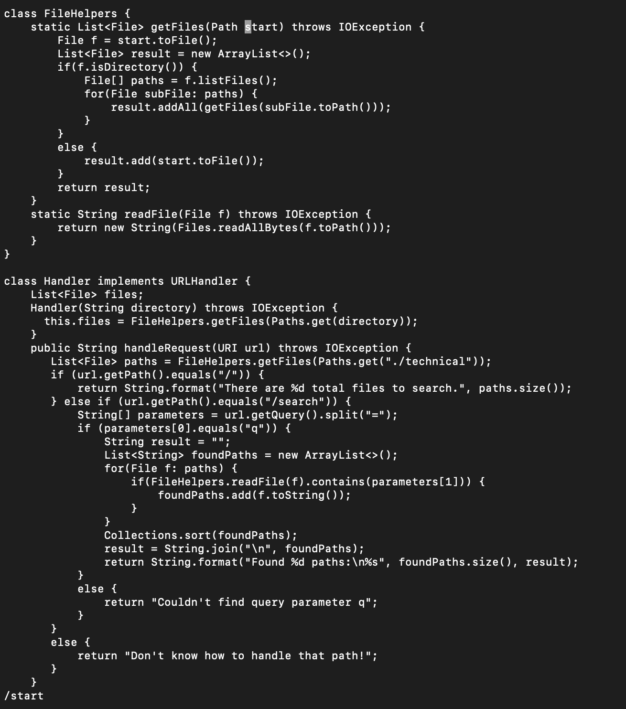
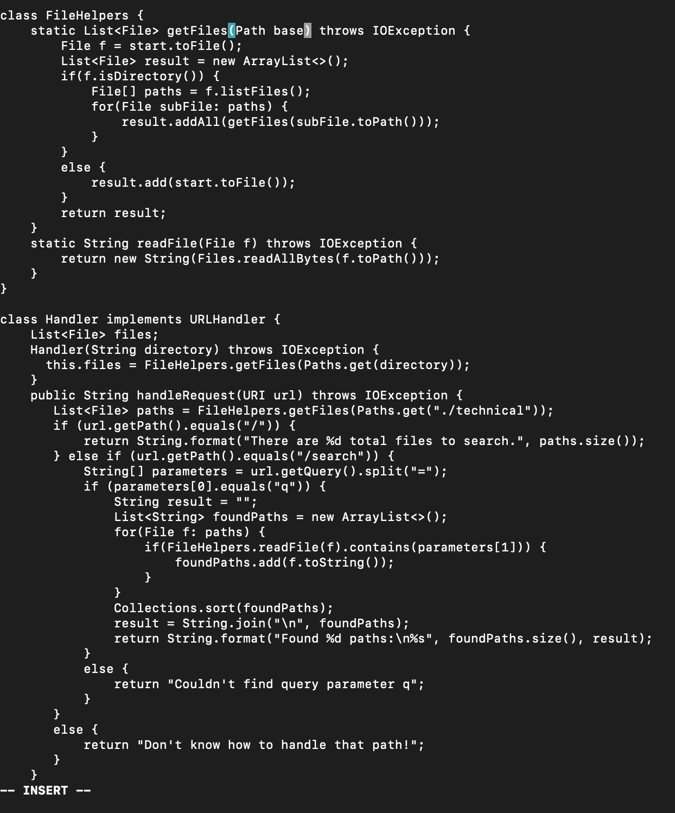

# Lab Report 4
## Part One: Vim Commands

In this part of the lab we are going to be using vim to edit a file using the shortest seqeunce possible in vim. Our task is to go into a file called DocSearchServer.java and edit the parameter of start in getFiles() to base. 
### Step 1: Searching for the term

In this part we wanted to search for the term we wanted to replace. We used the command "/[term]" to find the term we wanted. This location is indicated by the highlight of the first letter of the term in the image above. 


### Step 2: Replacing the Term

We now replaced the term we previously found using the "c+e" command. This highlighted the entire term and delted it whilst also putting us into insert mode. We then can type out the new term we want to put in. Which in our case was base. From there to change every instance of "start" we can use "n" to scroll through the remaining locations of the term based of the search command in the previous step. We then use "." to run the same command "c+e+[new term]" to edit the next case of the original term. We then keep repeating "n+." until we replace all the necessary terms. 

### Step 3: Saving the Changes

Once we are done making all the changes to the file all we have to do is save the file. The fastest way to do this is to entire the command ":wq" which takes a total of 4 keystrokes to accomplish. 

### Complete Keystroke sequence
```
"/+s+t+a+r+t+<Enter>+c+e+b+a+s+e+<Escape>+n+.+n+.+<Shift>+;+w+q+<Enter>"
```
The total number of keystrokes is 23, which is under the 30 maximum. 


## Part 2: Working Remotely

### Time Measurements:
#### Working in VSCode: 53 seconds   
The struggle in VSCode was that I had to save the file and then remember to scp to the remote server. In that process I also had to remember where I wanted to save the file there which took me a little longer to remember. Additionally, when I use VSCode I use the mouse to move around which takes up more time. 
#### Working in VIM: 38 seconds 
In VIM it was faster to edit the file  and run it remotely since I already started in the remote enviornment. It also is more efficient since there are a lot of commands that can be used so that only the keyboard is necessary. However, one drawback is the editor is plain and not fun to use. 

If I had a program that was running remotely, I would prefer using VIM to make edits since then I can already be logged onto the remote server and make changes. This means I do not have to spend time uploading the file to the remote server, which makes the editing process much quicker. 

Some factors that may affect my decions to use VIM or VScode is how big the project is. If the file has hundreds of lines that needs to be made mainly from scratch I would rather use VScode since it has many visual features built into it. VIM is best used when it comes to samll quick edits that can be done in seconds and need to be pushed quickly. 


