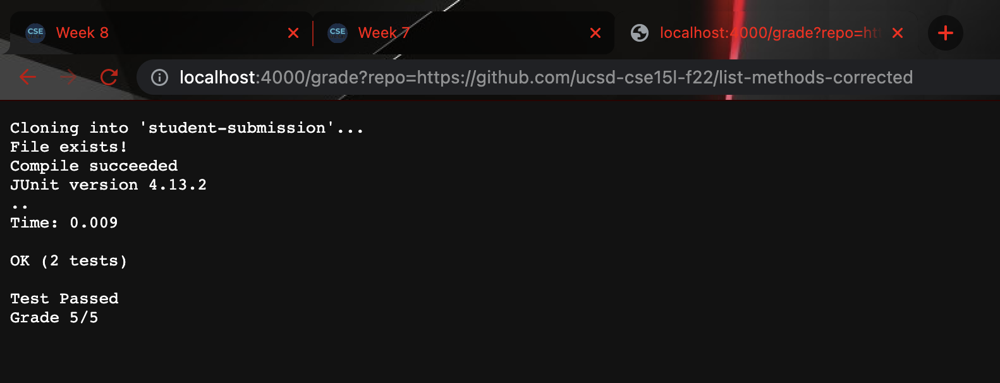
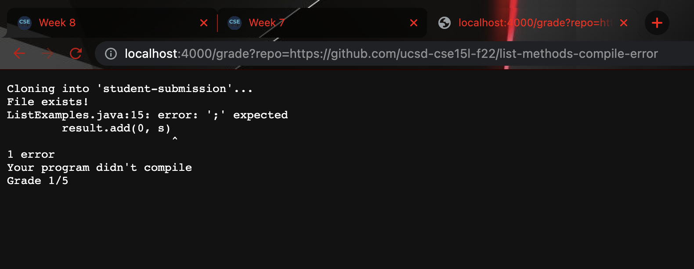
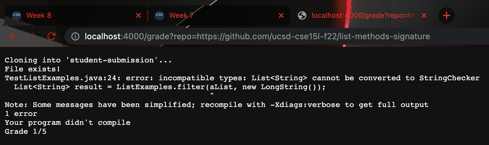

# Lab Report 5
In this lab report we are going to go over a grading script that will autograde student submissions, similar to what we see in gradescope. 

## Script Code
Here is an example of the script we used: 
```
CPATH=".:../lib/hamcrest-core-1.3.jar:../lib/junit-4.13.2.jar"
file="TestListExamples.java"

rm -rf student-submission >results.txt 2> errors.txt
git clone $1 student-submission >results.txt 2> errors.txt
cp TestListExamples.java student-submission/ >results.txt 2> errors.txt
cd student-submission >results.txt 2> errors.txt

if [[ -f $file ]] && [[ -e $file ]] 
then
    echo "File exists!"
else
    echo "File not found!"
    echo "Grade 0/5"
    exit 1
fi

javac -cp $CPATH *.java &> output.txt >results.txt 2> errors.txt

if [[ $? -eq 0 ]] > results.txt
then
    echo "Compile succeeded"
    cat results.txt
    cat errors.txt
 
else
    echo "Your program didn't compile"
    echo "Grade 1/5"
    cat results.txt
    cat errors.txt
    exit 2
   
fi

java -cp $CPATH  org.junit.runner.JUnitCore TestListExamples >results.txt 2>errors.txt

if [[ $? -eq 0 ]]
then
    echo "Test Passed"
    echo "Grade 5/5"
    cat results.txt
    cat errors.txt
    exit
    
else 
    echo "Test Failed"
    echo "Grade 3/5"
    cat results.txt
    cat errors.txt
    exit
fi

```
## Examples of Running the Script
We used a locally hosted server to run some submissions to test the validity of the script. Here are some of the results below: 


In the submission above, the student recieved full credit since the file was found, compiled, and passed the test cases. This results in the submission getting full marks. 


In the submission above, there is a compile error since the submission is missing a semicolon, which causes a compile error. As a result the grade is 1/5 with the one point coming from the file existing. 


In the submission above, there is a type error since the arguments of the filter method are in the wrong order. As a result of this, the file did not compile which results in a grade of 1/5, with the one point coming from the correct file being found. 


## Tracing the Script
Now we are going to be tracing the script as we run the student submission with the missing semicolon. For each command we are going to see what the standard output and standard error are as well as the return code. We are also going to see what conditionals are hit for each if statement and if any lines do not run. 

Our first command is removes the directory of the file which results in return code of 0, next we clone the student submission and make a copy of the test files in the same directory, after that we change our running directory to the directoy that contains the clone of the student submission and the test cases. This all results in return code of 0 per command since there are no errors. There was also nothing present in the stderr and stdout when we redirected the contents to a new text file. 

We next run an if statemnt to check wheter or not the file we are testing for exits. Since it does exist we go down the then branch of the if statement and return the string "File Found!". 

Then we run the command that compiles the student submission we get a return code that is not zero so it results in us going down the else branch of the if statement which returns as the string "Your Program did not compile Grade 1/5". We then exit the script returning the error code 2 which means the rest of the script does not run. 
